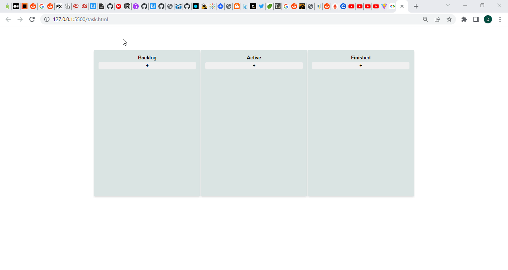

# Task-Management-App 
 
<h2>Live link - https://task-management-app-1212.netlify.app/</h2> 
 
<h2>Task Management Tool for tracking progress.</h2>

This web app is a popular task management tool. It has organised lists, for example, "BackLog", "Active", "Finished". Each list has multiple tasks. Tasks can be dragged and dropped between lists. Written in JavaScript/HTML/CSS.

Stack:
- HTML/CSS;
- JavaScript.

Future features:
- [ ] login functionality;
- [ ] multiple users;
- [ ] multiple Lists;

Created by Team CopyPaste as a part of Crework Project.
